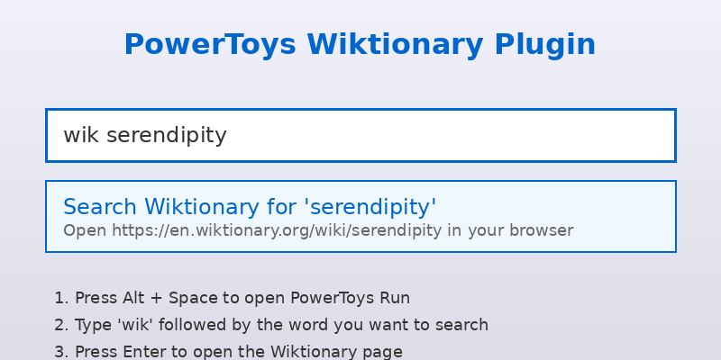

# command-palette-wiktionary

A PowerToys Run plugin to search Wiktionary for word definitions.



## Features

- Quick search for word definitions on Wiktionary
- Simple and fast access to dictionary definitions
- Opens results directly in your default browser

## Usage

1. Open PowerToys Run (default: `Alt + Space`)
2. Type `wik` followed by the word you want to search
3. Press Enter to open the Wiktionary page in your browser

### Example

```
wik serendipity
```

This will search for "serendipity" on Wiktionary.

## Installation

For detailed installation instructions, see [INSTALLATION.md](docs/INSTALLATION.md).

### Quick Start

1. Build the plugin:
   ```bash
   cd Community.PowerToys.Run.Plugin.Wiktionary
   dotnet build --configuration Release
   ```

2. Copy the build output to your PowerToys plugins directory:
   ```
   %LOCALAPPDATA%\Microsoft\PowerToys\PowerToys Run\Plugins\
   ```

3. Restart PowerToys

## Configuration

The default action keyword is `wik`. You can change this in PowerToys Settings:

1. Open PowerToys Settings
2. Go to PowerToys Run > Plugins
3. Find "Wiktionary" and modify the action keyword

## Contributing

Contributions are welcome! Please see [CONTRIBUTING.md](docs/CONTRIBUTING.md) for guidelines.

## Development

### Requirements

- .NET 8.0 SDK or later
- PowerToys (for testing)

### Building

```bash
cd Community.PowerToys.Run.Plugin.Wiktionary
dotnet build
```

## License

This project is licensed under the MIT License - see the [LICENSE](LICENSE) file for details.
